# Humanitec Change Log

This document provides an overview over the changes we are making over time. Feel free to reach out to us in case of any specific questions.

## Product Update November 13th, 2020

- **New:** A "My Apps" screen with all applications that a user has an access to as well as their respective environments. The user can choose to open the required application or an environment directly from the My Apps screen.  
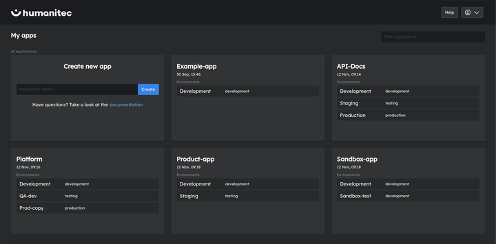
- **New:** Redirect to "My Apps" after deleting an application.
- **New:** Introduced an error screen for javascript errors and 404s with a redirect to "My Apps".

- **Fixed:**: Automated deployments do not show up in UI until they are finished.

- **Improved:** Scroll bars across application.

## Product Update October 30th, 2020

- **New:** Deleting Resource Definitions via the UI. If the resource definition has any active resources associated with it, the user is informed about those resources and their suggested replacements. If the user proceeds with the deletion, the resource definition will be marked with pending deletion until all active resources are redeployed.  

- **Improved**: Input component for shared value overrides.
- **Improved**: Snippet for Bitbucket integration.

- **Fixed**: Error handling in a case of a blank screen.
- **Fixed**: Allowing users to select “None” for static resources that do not need a driver.
- **Fixed**: Real-time updates for automated deployments.

## Product Update October 16th, 2020

- **New**: UI and API for adding your AKS and EKS clusters.  
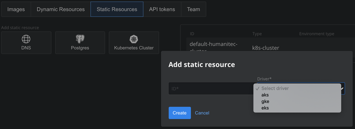
- **New**: UI and API for adding S3 Bucket resource definition and defining dependency within your modules.
- **New**: Welcome emails to newly registered users.

- **Improved**: Container runtime status added to application view - users can see at a glance if any of their modules are failing.  
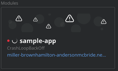
- **Improved**: Expandable deployment history view. Users can filter based on deployment comment and find their historical deployments easier.  

- **Improved**: CI integration guide - now presented as a wizzard.  
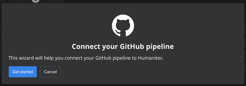

## Product Update October 2nd, 2020

- **New**: Export manifests for your chosen deployment set. Manifests can be downloaded as .yaml files and stored in a repository.  
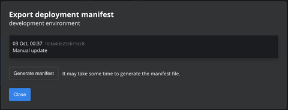
- **New**: UI support for connecting your own GKE or EKS cluster via Static Resources.  

- **Improved**: Possibility to add and confirm contact email through profile settings if it is not retrieved during registration.

## Product Update September 18th, 2020

- **New**: UI for adding AWS accounts for dynamic ressources  
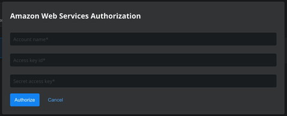
- **Improved**: UI for managing API Tokens
  - See all API Tokens for an organization in one list
  - Create new API Tokens
  - View and revoke existing API Tokens  
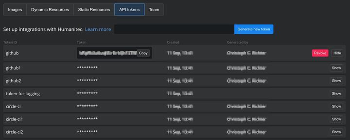

## Product Update September 4th, 2020

- **New**: UI for Runtime status
  - View the runtime status for deployed applications and easily debug errors when they occur
  - Users are informed if any of the replicas are failing and the affected deployment and modules are marked with a warning
  - To simplify debugging, container errors are reported for each replica separately and presented to the user together with the container log  
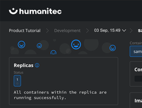
- **New**: API for deleting resources
- **Improved**: Live container logs
  - Users do not have to refresh to see the latest logs
  - Fixed UI issues and logs formatting
- **Fixed**: Wrong DNS being shown for modules (user reported bug)

## Product Update August 21st, 2020

- **Improved**: Container logs
  - Users can now see logs for each historical deployment
  - Fixed inconstiencies reported by users  
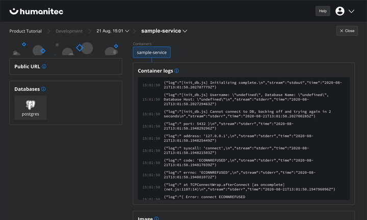
- **New**: [Humanitec CircleCI Orb](https://circleci.com/orbs/registry/orb/humanitec/humanitec) for simple integration between CircleCI and Humanitec  
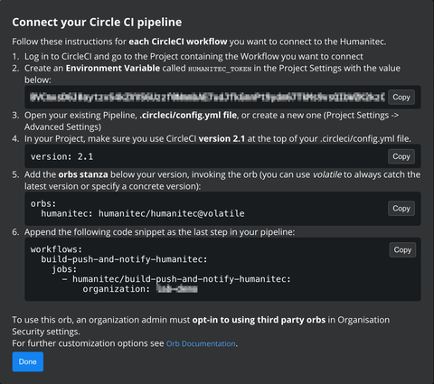

## Product Update August 7th, 2020

UI improvements:

- Separation between *Profile Settings* and *Organization Settings*  
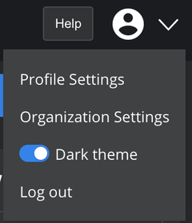

Documentation update:

- Release of the API documentation (currently in beta) available [here](https://api-docs.humanitec.com) incl. a first tutorial how to use the Humanitec API  
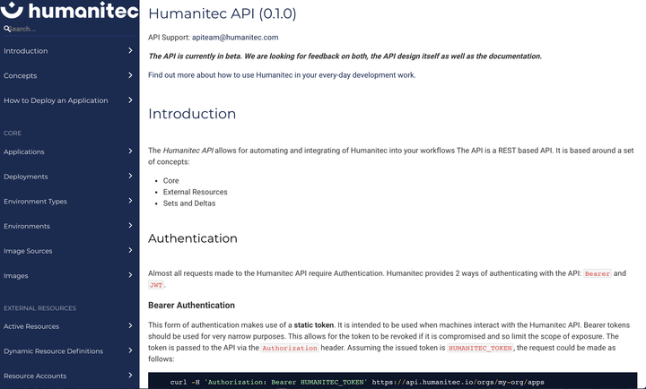

## Product Update July 24th, 2020

General new features:

- First version of automatic deployments based on user-defined rules  
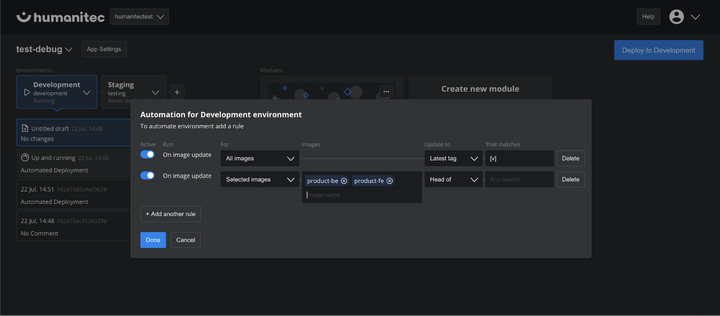  
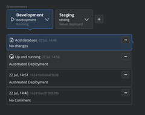

## Product Update July 10th, 2020

General new features:

- Allow users to connect dynamic resources of type Postgres with Google Cloud Platform resource account  
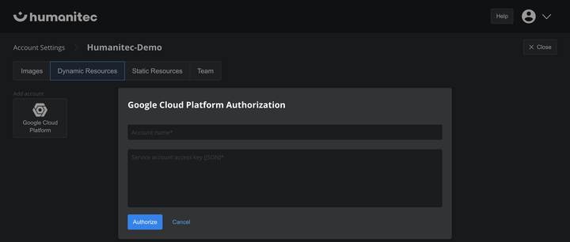

UI improvements:

- Better overview over available image versoins  

- Improved database selector  
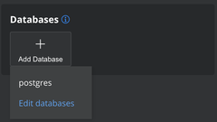

New API endpoints:

- API endpoint for deployment automation - allowing users to create, update and delete rules for automated deployments; Humanitec deploy new images automatically based on the defined rules

## Product Update June 26th, 2020

General new features:

- Option to create multiple deployment drafts in an environment  
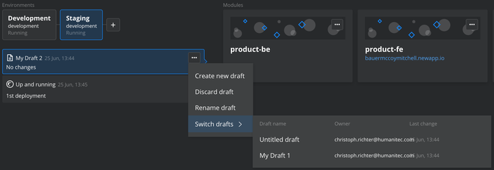

Onboarding support:

- First version of in-app guide explaining how to deploy your first application with Humanitec  
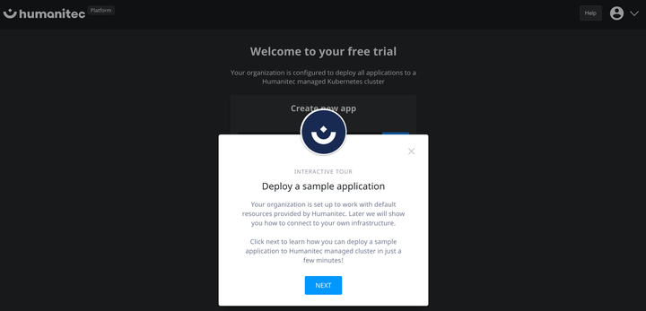

## Product Update June 12th, 2020

General new features:

- Option to create a diff between two deployment sets within one environment  
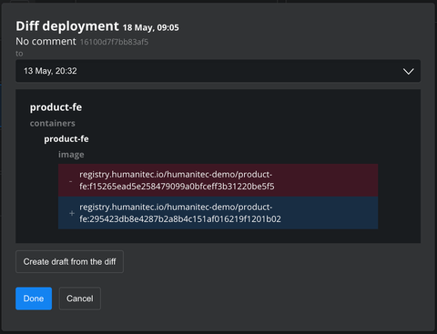
- Allow for patching of environments: apply a diff to a deployment set in any environment  
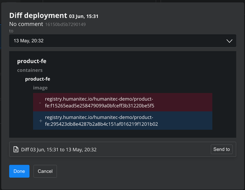

Onboarding support:

- Added sample images that allow for a quicker onboarding (e.g., option to deploy first application without connecting own CI pipelines)  
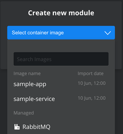

## Product Update May 29th, 2020

General new features:

- Option to clone deployments to another environment  
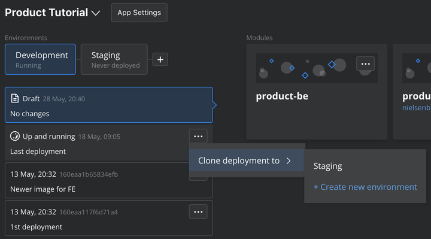
- Added Elasticsearch and MariaDB as managed images  
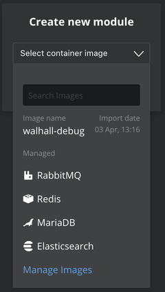
- Allow to switch between drafts and deployments directly from the module configuration view  

New features only available via the API:

- Deploy to your own GCP account (API documentation will be pusblished soon on our [docs site](https://docs.humanitec.com))
